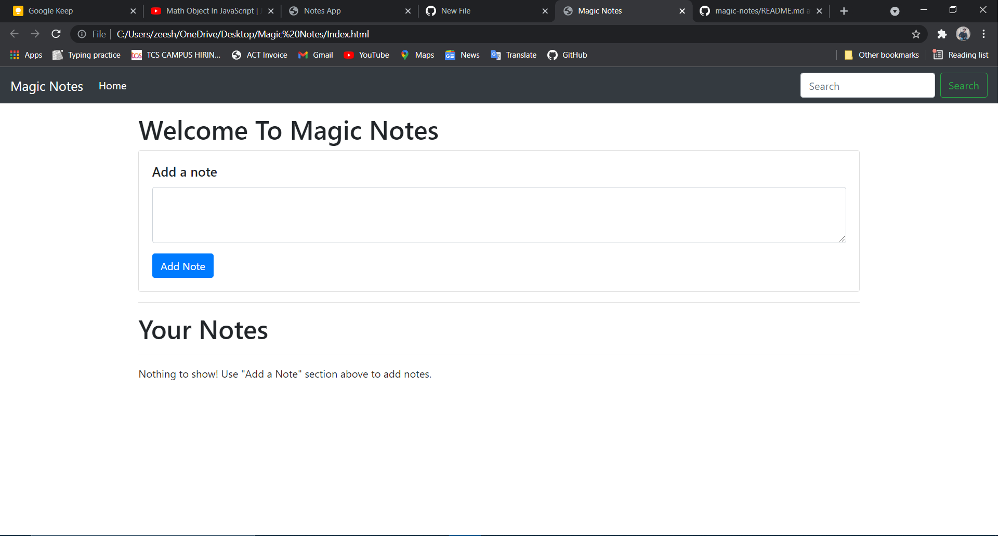

## View Live
> Magic Notes - https://github.com/mgous4mean/Magic-Notes.git

## About
> I have focused mainly on the functionality of the Webapp with the use of JavaScript and HTML. This basically will help us to create notes that can help us to note down in the form of list that we want, instead of writing down on paper.

## Screenshot

 

## Technologies
* HTML5
* Bootstrap
* Javascript

## Status
> Completed
